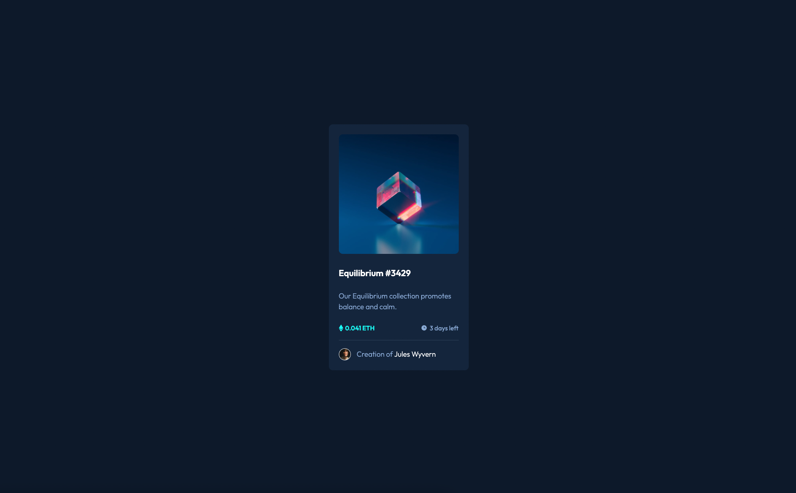

# Frontend Mentor - QR Code Component Solution

This is a solution to the [QR code component challenge on Frontend Mentor](https://www.frontendmentor.io/challenges/qr-code-component-iux_sIO_H). Frontend Mentor challenges help you improve your coding skills by building realistic projects. 

## Table of contents

- [Overview](#overview)
  - [Screenshot](#screenshot)
  - [Links](#links)
- [My process](#my-process)
  - [Built with](#built-with)
- [Author](#author)

## Overview
The challenge
Users should be able to:
  - View the optimal layout depending on their device's screen size
  - See hover states for interactive elements

### Screenshots

*Mockup*

*Screenshot*

### Links

- Solution URL: [GitHub](https://github.com/paulhjin/frontendmentor/tree/master/02-nft-preview)
- Live Site URL: [Netlify](https://pjin-fem-nft-preview-card-component.netlify.app)

## My process
- Always 📱 first ➡️ then 🖥️

### Built with
- Semantic HTML5 markup
- Mobile-first workflow

## Author
- Frontend Mentor - [@paulhjin](https://www.frontendmentor.io/profile/paulhjin)
- Github - [@paulhjin](https://github.com/paulhjin/)

