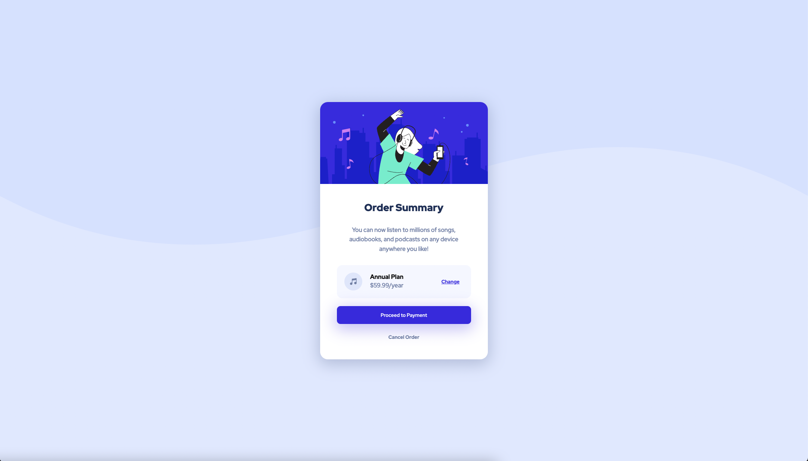

# Frontend Mentor - Order summary card solution

This is a solution to the [Order summary card challenge on Frontend Mentor](https://www.frontendmentor.io/challenges/order-summary-component-QlPmajDUj). Frontend Mentor challenges help you improve your coding skills by building realistic projects. 

## Table of contents

- [Overview](#overview)
  - [The challenge](#the-challenge)
  - [Screenshots](#screenshots)
  - [Links](#links)
- [My process](#my-process)
  - [Built with](#built-with)
- [Author](#author)

### The challenge

Users should be able to:

- See hover states for interactive elements:
  - Change
  - Proceed to Payment
  - Cancel Order

### Screenshots

### Links

- Solution URL: [Github](https://github.com/paulhjin/frontendmentor/tree/master/03-order-summary)
- Live Site URL: [Netlify](https://pjin-fem-order-summary-component.netlify.app)

### Built with

- Semantic HTML5 markup
- CSS custom properties
- Flexbox
- Mobile-first workflow

## Author
- Frontend Mentor - [@paulhjin](https://www.frontendmentor.io/profile/paulhjin)
- Github - [@paulhjin](https://github.com/paulhjin/)

