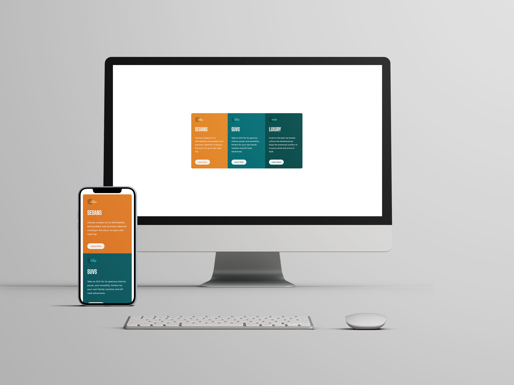
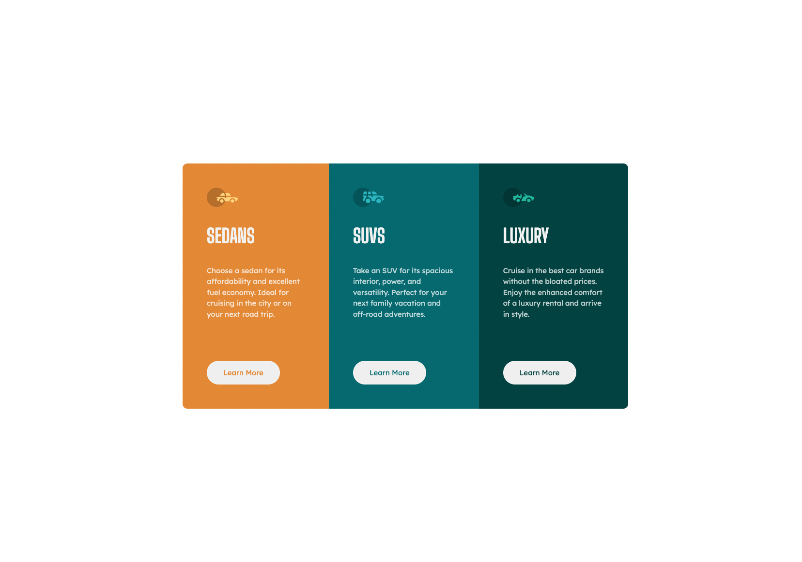
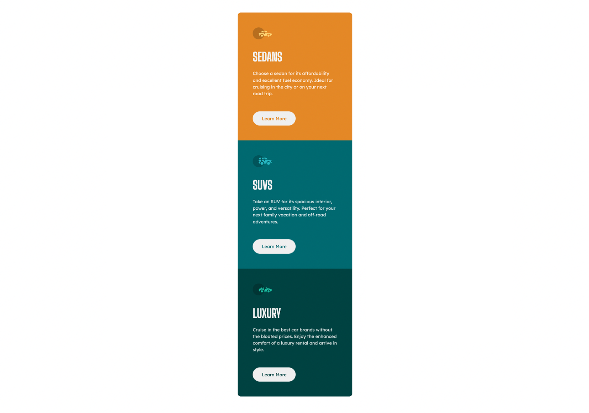

# Frontend Mentor - 3-column preview card component solution

This is a solution to the [3-column preview card component challenge on Frontend Mentor](https://www.frontendmentor.io/challenges/3column-preview-card-component-pH92eAR2-). Frontend Mentor challenges help you improve your coding skills by building realistic projects. 

## Table of contents

- [Overview](#overview)
  - [The challenge](#the-challenge)
  - [Screenshots](#screenshots)
  - [Links](#links)
- [My process](#my-process)
  - [Built with](#built-with)
  - [What I learned](#what-i-learned)
- [Author](#author)

## Overview

### The challenge

Users should be able to:

- View the optimal layout depending on their device's screen size
- See hover states for interactive elements

### Screenshots

Desktop Screenshot

Mobile Screenshot

### Links

- Solution URL: [Github](https://github.com/paulhjin/frontendmentor/tree/master/06-three-column-preview-card)
- Live Site URL: [Netlify](https://pjin-fem-three-column-preview-card-component.netlify.app)

### Built with

- Semantic HTML5 markup
- CSS custom properties
- Flexbox
- Mobile-first workflow

## Author
- Frontend Mentor - [@paulhjin](https://www.frontendmentor.io/profile/paulhjin)
- Github - [@paulhjin](https://github.com/paulhjin/)
