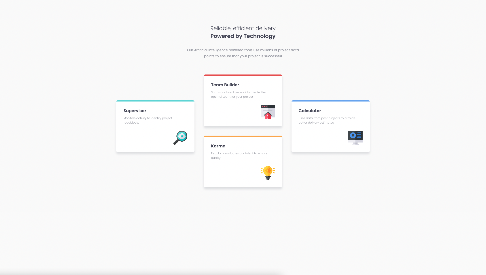

# Frontend Mentor - Four card feature section solution

This is a solution to the [Four card feature section challenge on Frontend Mentor](https://www.frontendmentor.io/challenges/four-card-feature-section-weK1eFYK). Frontend Mentor challenges help you improve your coding skills by building realistic projects. 

## Table of contents

- [Overview](#overview)
  - [The challenge](#the-challenge)
  - [Screenshots](#screenshots)
  - [Links](#links)
- [My process](#my-process)
  - [Built with](#built-with)
- [Author](#author)

## Overview

### The challenge

Users should be able to:

- View the optimal layout for the site depending on their device's screen size

### Screenshots


Desktop Screenshot



Mobile Screenshot


### Links

- Solution URL: [Github](https://github.com/paulhjin/frontendmentor/tree/master/09-four-card-feature)
- Live Site URL: [Netlify](https://pjin-fem-four-card-feature.netlify.app)

### Built with

- Semantic HTML5 markup
- CSS custom properties
- Flexbox
- Mobile-first workflow

## What I learned

- Creating the color strip at the top of the container using ::after since a border-top on the container curves the ends of the color strip to accommodate the border-radius.

HTML
```html
        <section class="card cyan shift">
            <h3>Supervisor</h3>
            <p>Monitors activity to identify project roadblocks</p>
            
        </section>
```
CSS
```css
.card {
    background-color: var(--clr-white);
    border-radius: 0.4rem;
    padding: 2rem;
    margin: 1.625rem 0;
    box-shadow: 0 0.5rem 0.625rem hsl(229, 6%, 66%, 0.3);
    position: relative;
    overflow: hidden;
}

.card::after {
    content: '';
    position: absolute;
    top: 0;
    left: 0;
    height: 0.3125rem;
    width: 100%;
}

.cyan::after {
    background-color: var(--clr-cyan);
}
```

## Author
- Frontend Mentor - [@paulhjin](https://www.frontendmentor.io/profile/paulhjin)
- Github - [@paulhjin](https://github.com/paulhjin/)


