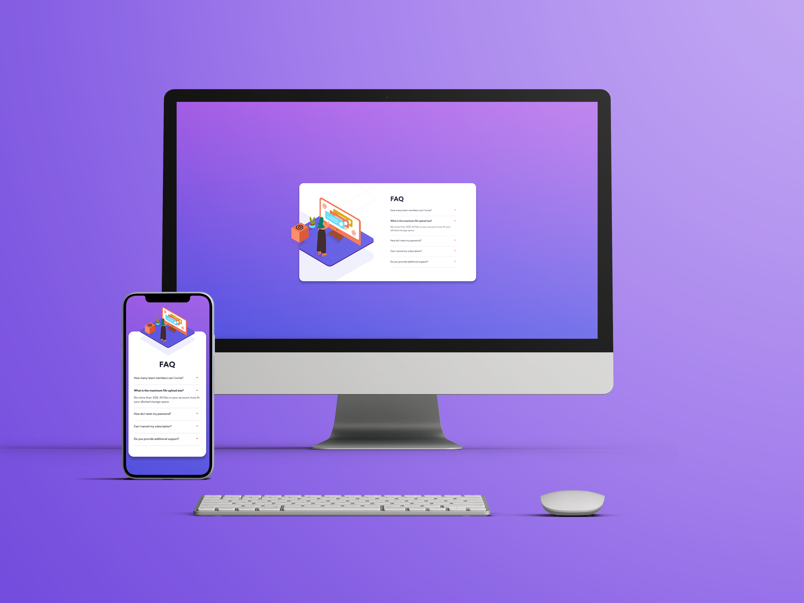
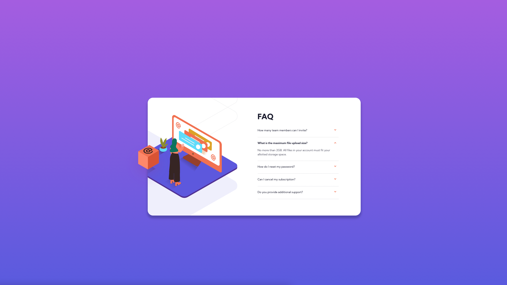
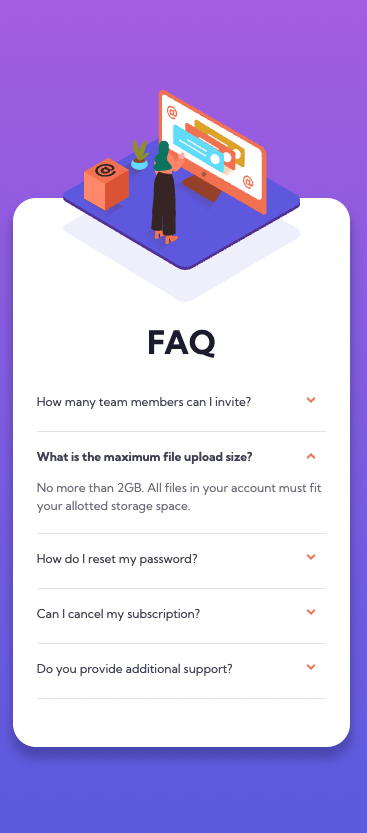

# Frontend Mentor - FAQ accordion card solution

This is a solution to the [FAQ accordion card challenge on Frontend Mentor](https://www.frontendmentor.io/challenges/faq-accordion-card-XlyjD0Oam). Frontend Mentor challenges help you improve your coding skills by building realistic projects. 

## Table of contents

- [Overview](#overview)
  - [The challenge](#the-challenge)
  - [Screenshots](#screenshots)
  - [Links](#links)
- [My process](#my-process)
  - [Built with](#built-with)
  - [What I learned](#what-i-learned)
- [Author](#author)

## Overview

### The challenge

Users should be able to:

- View the optimal layout for the component depending on their device's screen size
- See hover states for all interactive elements on the page
- Hide/Show the answer to a question when the question is clicked

### Screenshots



Desktop Screenshot



Mobile Screenshot



### Links

- Solution URL: [Github](https://github.com/paulhjin/frontendmentor/tree/master/12-faq-accordion-card)
- Live Site URL: [Netlify](https://pjin-fem-faq-accordion.netlify.app)

## My process

### Built with

- Semantic HTML5 markup
- CSS custom properties
- Flexbox
- CSS Grid
- Mobile-first workflow

### What I learned

Instead of adding eventListeners to every clickable element in the accordion, I learned to target selectors with event bubbling from [Go Make Things](https://gomakethings.com/checking-event-target-selectors-with-event-bubbling-in-vanilla-javascript/)

```js
// Listen to all clicks on the document
document.addEventListener('click', function (event) {
	var clickedElem = event.target;
	// Check if the event.target matches some selector, and do things...
}, false);
```

[W3Schools](https://www.w3schools.com/howto/howto_js_accordion.asp) also had a javascript accordion that animated up and down instead of just displaying the hidden content with a click.

Non-animated
```js
 if (panel.style.display === "block") {
      panel.style.display = "none";
    } else {
      panel.style.display = "block";
    }
```

Animated
```js
    if (panel.style.maxHeight) {
      panel.style.maxHeight = null;
    } else {
      panel.style.maxHeight = panel.scrollHeight + "px";
    }
```

scrollHeight (read-only property) is "a measurement of the height of an element's content including content not visible on the screen due to overflow." [MDN WEB DOCS](https://developer.mozilla.org/en-US/docs/Web/API/Element/scrollHeight)

```css
/* Add the following to the hidden element */
.hidden-container {
    max-height: 0;
    overflow: hidden;
    transition: 300ms ease;
}
```

## Author
- Frontend Mentor - [@paulhjin](https://www.frontendmentor.io/profile/paulhjin)
- Github - [@paulhjin](https://github.com/paulhjin/)

