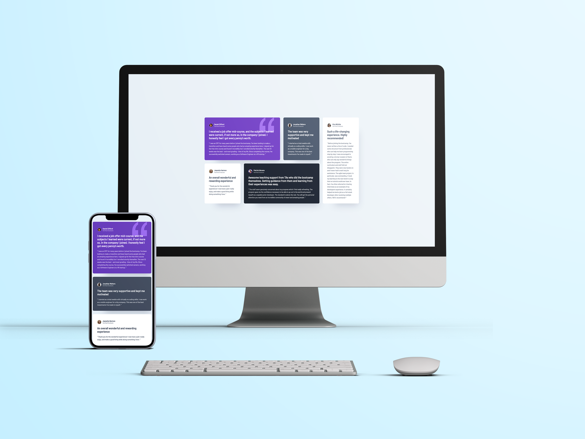

# Frontend Mentor - Testimonials Grid Section Solution

This is a solution to the [Testimonials grid section challenge on Frontend Mentor](https://www.frontendmentor.io/challenges/testimonials-grid-section-Nnw6J7Un7). Frontend Mentor challenges help you improve your coding skills by building realistic projects. 

## Table of contents

- [Overview](#overview)
  - [The challenge](#the-challenge)
  - [Screenshots](#screenshots)
  - [Links](#links)
- [My process](#my-process)
  - [Built with](#built-with)
  - [What I learned](#what-i-learned)
- [Author](#author)
- [Acknowledgments](#acknowledgments)

## Overview

### The challenge

Users should be able to:

- View the optimal layout for the site depending on their device's screen size

### Screenshots

Desktop Screenshot

Mobile Screenshot

### Links

- Solution URL: [Github](https://github.com/paulhjin/frontendmentor/tree/master/22-testimonial-grid-section)
- Live Site URL: [Netlify](https://pjin-fem-testimonial-grid-section.netlify.app)

## My process

### Built with

- Semantic HTML5 markup
- CSS custom properties
- Flexbox
- CSS Grid
- Mobile-first workflow

### What I learned
I've tried using a BEM-style approach in writing CSS but quickly realized it can be daunting and unnecessary for small pages and component challenges. So I figured a way out to shorten the CSS that I write by using a utility based approach Kevin Powell uses similar to Bootstrap or Tailwind CSS. I will implement more of this style moving forward to make my CSS cleaner and shorter. 

### Useful resources
- [Kevin Powell's Youtube for this Challenge](https://www.youtube.com/watch?v=rg7Fvvl3taU) 

## Author
- Frontend Mentor - [@paulhjin](https://www.frontendmentor.io/profile/paulhjin)
- Github - [@paulhjin](https://github.com/paulhjin/)

